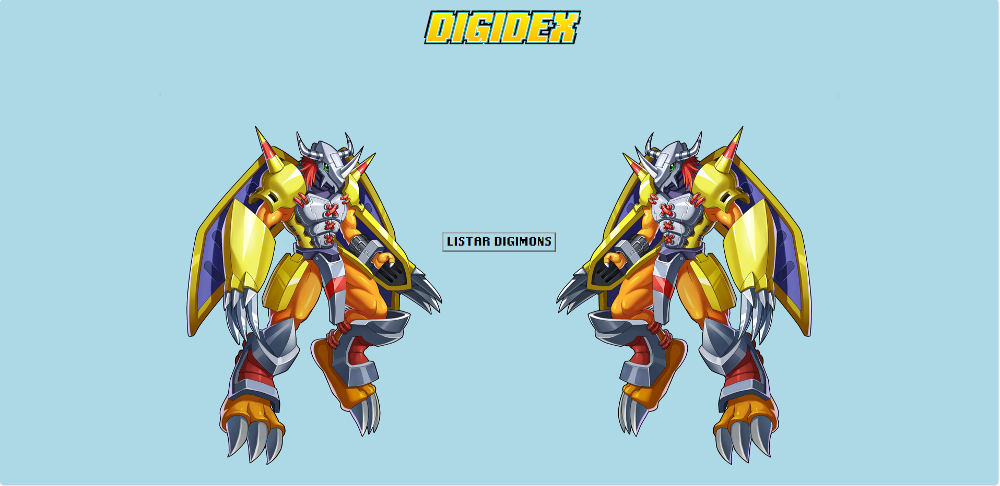
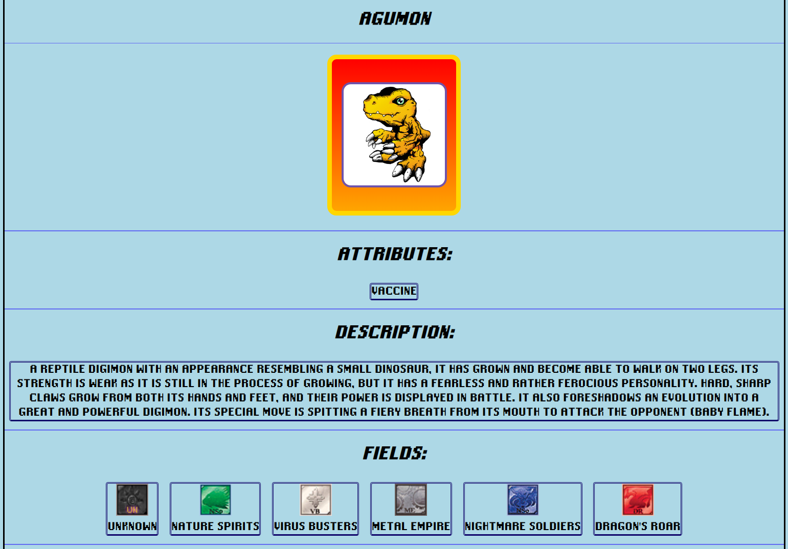

# Welcome to DigiDex

This was my first attempt to consume data from some API's to use in the first web page that I do.
  

# 📋 Features 📋
1. List of Digimon names (card format)
2. Attributes
3. Description
4. Fields
5. Levels
6. Prior and Next Evolutions
7. Skills
8. Types
 

# 📸 Screenshots 📸

* ## Home Page:

 

* ## Info Page:

 

# 🤗 Acknowledgments 🤗

Thanks to <a href="https://github.com/heyshadowsmith">Shadow Smith</a> for API with names: <a href="https://digimon-api.vercel.app/">Site</a> 
Thanks to <a href="https://github.com/Vinicius-Brito-Costa">Vinícius Brito Costa</a> for API with informations: <a href="https://digi-api.com/">Site</a> 
Thanks to <a href="https://twitter.com/lothusmarque">Lothus Marque</a> for font: <a href="http://www.mercenary-enclave.com/otherstuff.php#Digimonfont">Site</a>
